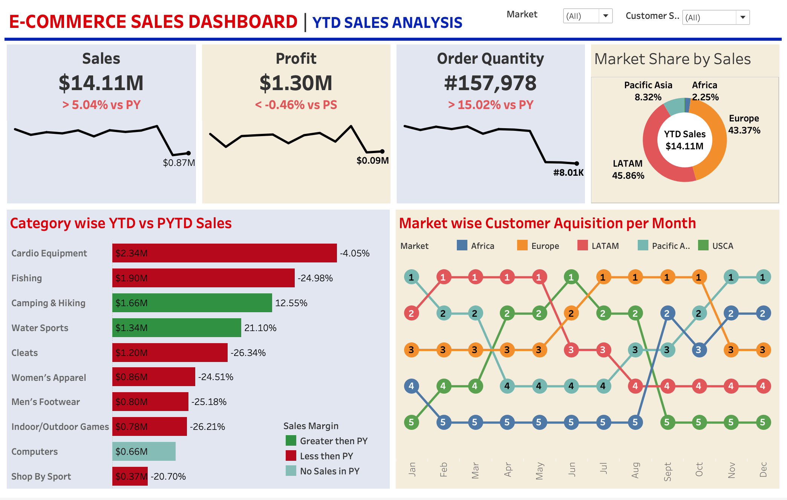

# E-Commerce Sales Dashboard

## Project Overview
This project is an interactive E-Commerce Sales Dashboard created using Tableau to analyze sales performance, profit trends, category-wise analysis, and regional business insights.

## Tools Used
- Tableau
- Excel

## Dashboard Features
- Sales KPI Analysis
- Profit Tracking
- Regional Sales Insights
- Category-wise Analysis
- Interactive Filters & Charts

## Live Dashboard
[View Tableau Dashboard](https://public.tableau.com/app/profile/kailash.suthar/viz/ECOMMERCESALESDASHBOARD_17785621490540/E-COMMERCESALESDASHBOARD)

## Dashboard Preview

